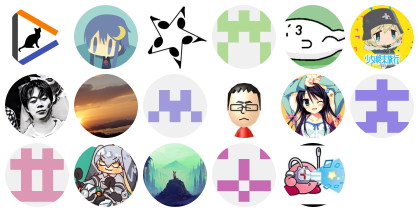

[English](README.md) | **日本語**
 

<h1 align="center">TheDesk</h1>

  

  
Mastodon client for PC(Windows/Linux/macOS)  
オープンソースSNSマストドンのPC向けクライアント  

  

## 翻訳
  
Crowdinから翻訳に参加してみませんか？: https://translate.thedesk.top  

## ビルドと開発

[Wiki](https://github.com/cutls/TheDesk/wiki)を参照。

## Pleromaのサポート

Pleromaは、Mastodon APIとの互換性を謳っていますが、実際には様々な差異があり、TheDeskで不具合が発生することがあります。  
Issuesに書いてある問題についてはなるべく対処しますので、ぜひお知らせください。

## よみもの

* [TheDesk - マストドン日本語ウィキ](https://ja.mstdn.wiki/TheDesk)
* [TheDeskを作って思う今クライアントを作る意味 | Cutls Code Archives ](https://code.cutls.com/thedesk-log/)

## ライセンス

* [GNU General Public License v3.0](https://github.com/cutls/TheDesk/blob/master/LICENSE)
* [License of other assets](https://github.com/cutls/TheDesk/wiki/License-of-other-assets)
* [プライバシーポリシー](https://thedesk.top/priv.html)

## 主なコントリビューター

## 支援

[その他の支援法](https://cutls.dev)
